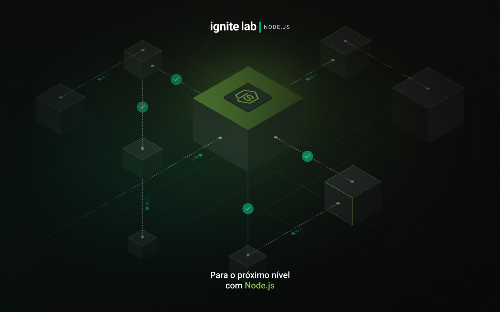

⚡ Notification Service - Ignite Lab Nodejs
</h3>

## 📖**Sobre**

- O projeto consiste em uma API de envio de notificaçõs, Permite o usúario create, read, unread, cancel, count, and List all Notifications.

## 🚀 **Tecnologias**

- Typescript
- Nodejs
- Nestjs
- Prisma
- Jest
- SQLite 

## 💻 **Como executar*

Rotas da aplicação

- Post - `notification` - Create
- Patch - `:id/read` - read
- Patch - `:id/unread` - unread
- Patch - `:id/cancel` - cancel
- Get - `count/from/:recipientId` - count
- Get - `from/:recipientId` - list all notifications

- Para testar o funcional das rotas acima, necessário utilizar o `insomnia` ou `postman`, para trabalhar com as requisições http.

## Para rodar essa aplicação siga os seguintes passos:

- Copie a url do repositório na aba `CODE`.
- Com o git instalado, execute o seguinte comando => `git clone "Aqui vai a url copiada acima`.
- Com o `Nodejs` e ou `Yarn` instalados, Na sua IDE preferida, abra o terminal do `git`, e execute o seguinte comando => `yarn ou npm i`, para baixar as dependências da aplicação.
- Para rodar o projeto execute o seguinte comando => `yarn star:dev`.
- Para rodar os testes unitários das rotas da aplicação execute o seguinte comando => `yarn test`.
- Para visualizar a ferramenta de interface gráfica de gerenciamaneto de banco de dados do `Prisma`, para visualizar a tabela do BD, execute o seguinte comando `npx prisma studio`, e abra a `url` apresentada.
